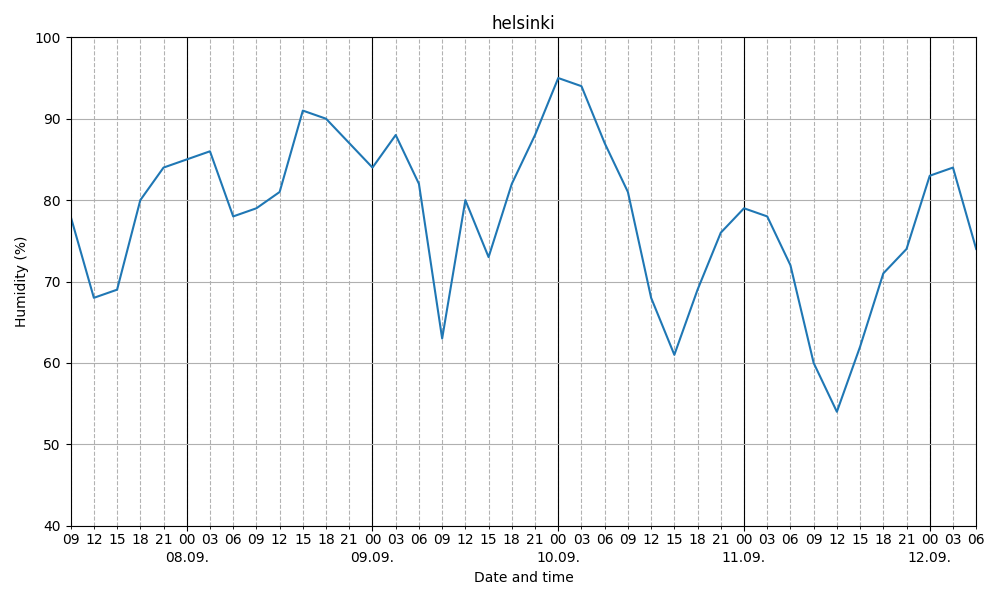

# Humidity Forecast Tool

This tool fetches OpenWeather forecasts and plots the humidity for easy viewing.

## Example


# Requirements
The tool uses Python and requires click, matplotlib and requests to work. The easiest way to install all the requirements is to run
```
pip install -r requirements.txt
```

# Usage

You can get a forecast using command
```
python forecast.py forecast [location] [API key]
```
where location can be a for example just a city ("Helsinki") or include the country ("Helsinki,FI"). Personal OpenWeather API key can be acquired by registering to [OpenWeather](https://openweathermap.org/). By default the tool saves the forecast to `forecast.png`. Different output file can be specified using `--output` flag.
